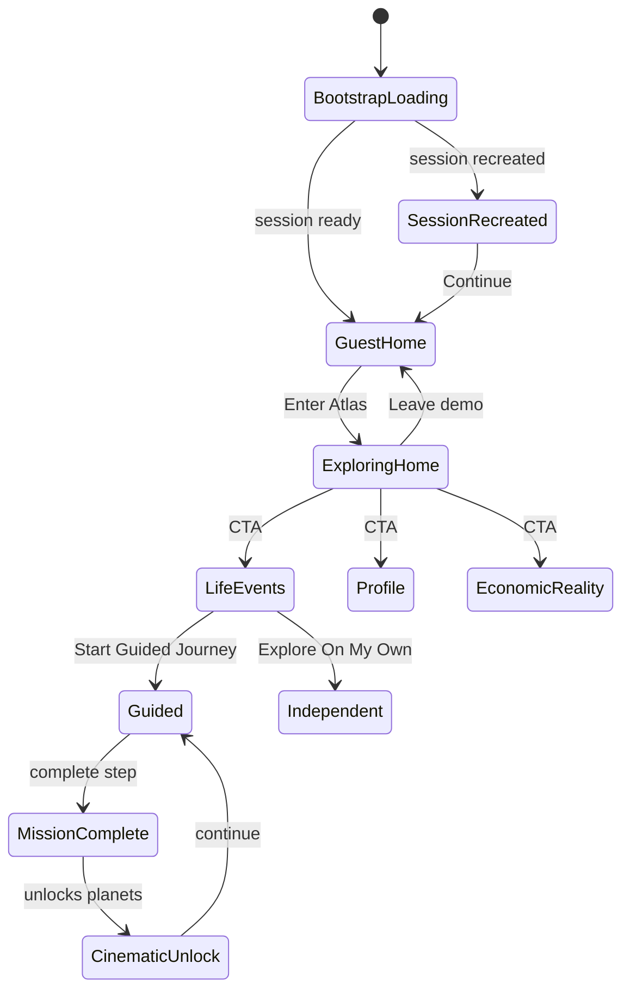

# Arrival Atlas — Complete Product Walkthrough

**Audience:** UX consultant who has never seen the project  
**Scope:** Every user-facing screen, module, navigation path, interaction, animation, CTA, visual hierarchy, state, and flow  
**Method:** Codebase walkthrough of `apps/web` (July 2026, post arr-031/032)  
**Screenshots:** Not embedded in repo — reference paths below map to live UI surfaces (`data-ui-surface` attributes where noted)

---

## 0. Product in one sentence

Arrival Atlas is a **decision-support web app for migrants in Germany** that frames bureaucracy as **spatial navigation**: a home star map for orientation, then three **galaxy modules** (Life Events, Economic Reality, Profile) where planets are tasks/domains/cards, routes show dependencies, and an AI-style **Journey Guide** coaches first-time users.

**There is no real account system in the current demo** — users “Enter Atlas” into a local demo mode backed by an anonymous API session.

---

## 1. Global shell — what wraps every screen

### 1.1 Bootstrap (first paint)

**Surface:** `data-ui-surface="bootstrap-loading"`  
**File:** `BootstrapGate.tsx`

| State | What user sees |
|-------|----------------|
| **Loading** | Centered card, skeleton, “Loading…” |
| **Error** | Error panel + Retry button |
| **Ready** | App content renders |

**Duration:** Until `ensureSession()` completes (creates or restores anonymous session).

**Session recreated (invalid stored session):** Modal `SessionRecreatedNotice` — “A new Atlas session has started” + Continue. Demo flag cleared → guest HUD until user re-enters Atlas.

### 1.2 Persistent spatial background

**Files:** `UnifiedAppShell.tsx`, `PersistentSpatialCanvas.tsx`

- Dark theme (`data-theme="dark"`) — always
- Subtle animated starfield / spatial canvas behind all pages
- Parallax on destination pages (disabled with `prefers-reduced-motion`)

### 1.3 Atlas HUD (primary chrome)

**File:** `AtlasHUD.tsx` — mounted on `/` and all destination routes

```
┌─────────────────────────────────────────────────────────────┐
│ [Logo → /]     [Nav links if exploring]     [CTA button]   │
└─────────────────────────────────────────────────────────────┘
```

| Mode | Nav | Right CTA |
|------|-----|-----------|
| **Guest** | Hidden (spacer) | **Enter Atlas** |
| **Exploring demo** | Explore Atlas · Life Events · Economic Reality · Profile | **Leave demo** |

**Visual hierarchy:** Logo (brand anchor) → nav (when visible) → single primary action right-aligned.

**Mobile ≤960px:** Primary nav **hidden** — only logo + Enter Atlas / Leave demo remain. No hamburger drawer in production HUD.

### 1.4 Demo state machine

| State | Storage | UI effect |
|-------|---------|-----------|
| Guest | `arrival_atlas_demo_active` absent | Guest landing, no nav |
| Exploring | `localStorage` = `'1'` | Member slider on `/`, full HUD nav |
| Leave demo | Cleared + session reset | Returns to guest, redirect `/` |

Cross-tab: storage events sync demo flag between browser tabs.

---

## 2. Route map (complete)

| URL | Screen name | Galaxy? | Journey Guide? |
|-----|-------------|---------|----------------|
| `/` | Atlas Home | Star map (not full galaxy) | No |
| `/modules/life-event` | Life Events | Yes | Yes |
| `/modules/economic-reality` | Economic Reality | Yes | Yes |
| `/modules/[moduleId]` | Generic module form | No | No |
| `/profile` | Profile summary galaxy | Yes | Yes |
| `/profile/[domainSlug]` | Profile domain detail | Yes | Yes |
| `/profile/[domainSlug]/edit` | Domain correction form | No | No |
| `/admin/mbde` | MBDE admin (internal) | No | No |

**No custom `not-found.tsx`** — unknown URLs get Next.js default 404.

---

## 3. Screen-by-screen walkthrough

---

### 3.1 `/` — Atlas Home

**Reference:** `app/page.tsx` → `AtlasHomePage.tsx`

Two mutually exclusive experiences gated by `isExploringAtlas`.

#### 3.1.A Guest landing (default first visit)

**Component:** `AtlasGuestLanding.tsx`  
**Reference:** `data-ui-surface` on guest hero

**Layout (desktop):** Copy left · static star map right · HUD top  
**Layout (mobile ≤1100px):** Copy stacked above map

**Visual hierarchy:**
1. Eyebrow: “Personal Life Navigation”
2. Headline: “Your new life. **Mapped.**”
3. Supporting paragraph
4. Primary CTA: **Enter Atlas**
5. Secondary CTA: **See what's next in 7 days** (same action as primary — both call `enterAtlas()`)

**Star map (guest):**
- Center node: **YOU ARE HERE**
- Satellites: Registration, Housing, Healthcare, Finance, Work & Growth, Community
- **Non-interactive** — decorative orientation only
- Subtle load animation via `useAtlasLoadSequence` (phased reveal)

**Animations:** Ambient particles, connection lines, node glow — disabled under `prefers-reduced-motion`

**User intent:** Understand what the product is; decide to explore.

#### 3.1.B Member slider (after Enter Atlas)

**Component:** `AtlasSlider.tsx` (exported as `AtlasMemberSlider`)

**Layout:**
```
┌──────────┬─────────────────────┬──────────────┐
│ Slide    │   Interactive map   │  Side panel  │
│ rail     │   (AtlasMap)        │  (focus area)│
│ 01–06    │                     │              │
├──────────┴─────────────────────┴──────────────┤
│           Journey timeline (4 stages)          │
└────────────────────────────────────────────────┘
```

**Six slides** (`atlas-data.ts`):

| # | Theme | Headline accent | Primary CTA | Destination |
|---|-------|-----------------|-------------|-------------|
| 01 | Orientation | Mapped. | Enter Your Atlas | `/modules/life-event` |
| 02 | Registration | big picture. | Start Registration | `/modules/life-event` |
| 03 | Housing | where you live. | Explore Housing | `/profile` |
| 04 | Healthcare | coverage. | Open Healthcare | `/profile` |
| 05 | Finance | stability. | View Economic Reality | `/modules/economic-reality` |
| 06 | Growth | long term. | Continue Your Plan | `/modules/life-event` |

**Every slide secondary CTA:** “See what's next” → `/modules/life-event`

**Map interactions (member only):**
- Click domain node → jumps to corresponding slide
- Map pans/zooms to `focusNode` per slide
- Connection emphasis changes per slide
- Keyboard: ← → between slides

**Side panel** (`AtlasSidePanel.tsx`): Focus Area title, status, remaining items list, tone (overview / action / warning)

**Journey timeline** (`JourneyTimeline.tsx`): Arrival (Week 1) → Setup (Week 2–3) → Stabilize (Month 1–2) → Build (Long term) — highlights current stage per slide

**Animations:** Slide cross-fade, map focus transition, panel slide-in with blur, timeline progress glow

---

### 3.2 `/modules/life-event` — Life Events Galaxy

**Reference:** `modules/life-event/page.tsx`

**Viewport label:** Localized module title (DE/RU/UA/EN via `t()`)

#### States

| State | Overlay | User action |
|-------|---------|-------------|
| Module loading | Skeleton | Wait |
| Module error | Error + retry | Retry |
| Cold start (no plan, incomplete profile) | **Intake form overlay** | Fill short form |
| Plan loading | Wireframe skeleton | Wait |
| Plan error | Error panel | Retry |
| Plan ready | Galaxy + inspector | Navigate graph |
| Scenarios mode (`?mode=scenarios`) | Collapsible Scenarios HUD | Explore what-if |

#### Galaxy layout

```
┌────────────────────────────────────────────────────────────┐
│ HUD                                                        │
├──────────────────────────────────────────┬───────────────┤
│                                          │  Inspector    │
│     Planets orbiting "Your Journey"      │  (when node   │
│     + dependency routes                  │   selected)   │
│                                          │               │
│  [Journey Guide probe + speech]          │               │
│  [Scenarios <details> panel]             │               │
└──────────────────────────────────────────┴───────────────┘
```

#### Planet states

| Visual | Meaning |
|--------|---------|
| Normal | Available step |
| Locked + padlock | Prerequisites incomplete |
| Recommended glow | Journey Guide highlight |
| Dimmed | Guide focus / route preview / cinematic |
| Completed styling | Step done |
| Cinematic pulses | Unlock animation in progress |

#### Inspector sections (when planet selected)

1. **Context** — what this step is
2. **Unlocks** — what opens after completion
3. **Blocked** — constraints
4. **Actions** — links/buttons to execute step
5. **Recommendations** (when applicable)

**Status chips:** Completed · Blocked · Recommended now · Future

#### Journey Guide on this surface

See §4 — full guide lifecycle applies here.

#### Query params

- `?event=` — pre-fill scenario context
- `?mode=scenarios` — open scenario explorer

---

### 3.3 `/modules/economic-reality` — Economic Reality Galaxy

**Reference:** `EconomicRealityPage.tsx` → `EconomicRealityGalaxyBridge.tsx`

**Same galaxy pattern** as Life Events but planets = **economic cards** (intents, resources, actions, profile links).

**Copy:** Server-driven, localized via `useEconomicCopy()` — card titles and section labels follow session language.

**Inspector card-type explanations:** Different boilerplate per card type (profile / intent / resource / action).

**Dev-only:** Debug toggle shows plan JSON in collapsible panel.

**Empty state:** Message when no presentation available.

---

### 3.4 `/profile` — Profile Galaxy (summary)

**Reference:** `profile/page.tsx` → `ProfileGalaxyBridge.tsx`

**Center node:** “Your situation”  
**Planets:** Identity domains (move-to-germany, housing, household, work-income, health-insurance, benefits-support, language-display, etc.)

**Inspector actions:**
- **View full domain** → `/profile/[domainSlug]`
- **Edit domain** / **Correct information** → edit flow
- **Open {module}** → cross-module link (e.g. Economic Reality)

**Loading:** “Loading…” overlay until snapshot ready  
**Error:** “Unable to load your situation”

**Correction toast:** Appears on return from edit with `?updated=1` — fixed below HUD, auto-dismiss 4.2s

---

### 3.5 `/profile/[domainSlug]` — Domain detail galaxy

**Deep-link** to one domain with expanded inspector (detail depth).

**Invalid slug:** Inline “This section could not be found.” — no branded 404, no home link.

---

### 3.6 `/profile/[domainSlug]/edit` — Domain correction form

**Layout break:** Leaves galaxy — standard form page (`DomainMutationEditor` in `AtlasSurface` card).

**CTAs:**
- **← Back to {domain}** (cancel)
- **Save** → redirects to `/profile/[domainSlug]?updated=1`

**Fields:** Domain-specific profile fields per product contract.

**Success feedback:** Toast on destination page, not on form itself.

---

### 3.7 `/modules/[moduleId]` — Generic contract modules

**Served modules:** `financial-reality`, `benefits-simulator`, `system-translation`, `healthcare-navigation`, `grocery-optimization`, etc.

**Layout:** Legacy panel — schema-driven form + results panel + optional Explain panel.

**Not found:** “Module not found.” — no recovery link.

**Note:** `financial-reality` and `economic-reality` are **different experiences** — profile may link to form while HUD links to galaxy.

---

### 3.8 `/admin/mbde` — Internal admin

Benefit graph JSON editor. Not user-facing. Requires session. Plain admin layout without galaxy chrome.

---

## 4. Overlay & modal inventory

| Overlay | Trigger | Type | Dismiss |
|---------|---------|------|---------|
| **SessionRecreatedNotice** | Invalid session on load | alertdialog | Continue |
| **LeaveDemoConfirm** | Leave demo | dialog | Keep exploring / Start over |
| **Journey Guide Welcome** | First visit per galaxy | dialog | Start Guided / Explore On My Own |
| **Journey Guide speech** | Guided mode, locked click | Anchored bubble | Close / actions |
| **Journey Guide FAB** | Independent mode | Floating button | Opens panel |
| **Cinematic discovery** | Mission unlock | Full-viewport overlay | Auto → guide phase |
| **Route preview dim** | Preview route | Ambient veil | ~3.5s auto |
| **Life Event intake** | Cold start | Viewport overlay | Submit form |
| **Profile correction toast** | `?updated=1` | Fixed toast | Auto or × |
| **ProfileLoadErrorBanner** | Profile fetch fail | Sticky banner | Retry |
| **Bootstrap loading/error** | Session bootstrap | Full-page gate | Retry |

**Stacking risk:** Life Events first visit can show Guide Welcome + Intake overlay concurrently.

---

## 5. Journey Guide — complete interaction model

**Persistence:** `localStorage` key `arrival-atlas-journey-guide-v1` — per surface, per browser.

### 5.1 Welcome (first visit)

- **Copy:** “Welcome to Arrival Atlas.” / “Let's build your journey together.”
- **CTAs:** Start Guided Journey · Explore On My Own
- **Visual:** Stage dimmed (`is-guide-welcome`)

### 5.2 Guided mode

- Recommends one planet as **next mission**
- Auto-opens panel (stages 1–2) until dismissed
- **Preview route** — illuminates prerequisite chain ~3.5s
- **Take Me There** on locked planets — jumps to prerequisite
- Probe orbits recommended node with speech bubble

### 5.3 Independent mode

- Passive — floating **Journey Guide** button bottom-right
- **Resume guided journey** available in speech

### 5.4 Locked planet interaction

- Click locked → speech: “Destination locked” + required steps list
- Hover tooltip: “Requires: … completed”

### 5.5 Cinematic unlock (arr-031)

**Trigger:** Complete mission + unlock new planets in same tick

| Phase | Duration | Visual |
|-------|----------|--------|
| Completion | ~1s | Source planet pulse, galaxy dims |
| Routes | ~450ms/hop | Edge traversal animation |
| Emergence | ~650ms/node | Lock fade, color restore |
| Overlay | ~2.8s | “New route discovered” list |
| Guide | ~4s+ | Explanation + **Replay discovery** |

**Reduced motion:** All cinematic keyframes suppressed.

---

## 6. Animation & motion catalog

| System | Location | Purpose |
|--------|----------|---------|
| Atlas home load sequence | `useAtlasLoadSequence` | Staggered reveal |
| Map focus/pan | `AtlasMap.tsx` | Slide sync |
| Galaxy orbit spin | `life-event-polish.css` | Ambient life |
| Dependency gravity | `GalaxyGraphStage` | Hover pull toward prerequisites |
| Edge hierarchy | Active/inactive stroke weights | Selection context |
| Journey Guide probe glow | CSS pulse | Draw attention |
| Cinematic unlock | Multi-phase CSS | Reward completion |
| Spatial page enter | `SpatialPageShell` | Destination transition |
| Profile toast | `profile-correction-toast-in` | Confirm save |

**Accessibility:** `prefers-reduced-motion` honored in galaxy, home, celestial, and toast CSS; Framer Motion checks in spatial shell.

---

## 7. i18n exposure

| Language | Code | Where exposed in UI |
|----------|------|---------------------|
| English | en | Default everywhere |
| German | de | Life Events, Economic Reality, common strings |
| Russian | ru | Same modules |
| Ukrainian | ua | Same modules |

**Language picker:** Implemented in **unmounted** `Header.tsx` drawer — **not reachable in production HUD**.

**English-only today:** Journey Guide, Atlas home marketing, galaxy inspector boilerplate, Profile galaxy labels, mission titles.

---

## 8. First-time user journey — launch to first important task

**Persona:** New migrant, stressed, opens app for first time on phone (375px).

### Act 1 — Arrival (0–30 seconds)

1. **Bootstrap loading** — skeleton, “Loading…” (anonymous session created)
2. **Guest landing** — dark starfield, headline “Your new life. Mapped.”
3. **HUD:** Logo + **Enter Atlas** only (no nav)
4. User reads marketing copy OR taps Enter Atlas immediately

### Act 2 — Orientation (30–90 seconds)

5. **Member slider slide 01** — interactive map appears, timeline shows “Arrival Week 1”
6. User may click map nodes (changes slides) or read side panel
7. **Primary CTA:** “Enter Your Atlas” → `/modules/life-event`

### Act 3 — Life Events entry (90–180 seconds)

8. **Galaxy viewport** loads — planets orbit “Your Journey”
9. **Journey Guide Welcome** modal appears (may compete with intake overlay if profile empty)
10. User chooses **Start Guided Journey**
11. Guide highlights recommended planet, opens panel with mission title + reason

### Act 4 — First important task (3–10 minutes)

**Path A — Has profile data:**
- User clicks recommended planet → reads inspector → clicks action link
- Completes first mission step (e.g. registration-related action)
- **Cinematic unlock** may play if prerequisites unlock new planets

**Path B — Cold start (empty profile):**
- **Intake overlay** blocks galaxy — short form
- User submits → plan generates → galaxy populates
- Then guided recommendation appears

**Path C — Mobile without entering Atlas nav:**
- User on guest landing cannot reach modules via HUD
- Must use Enter Atlas first OR know URL

### Act 5 — First “win” moment

Successful completion of first recommended Life Event step + cinematic unlock OR profile field saved with correction toast = first tangible progress signal.

**Friction points on this path:**
- No language picker in HUD
- Mobile nav hidden after Enter Atlas on non-home routes
- Guide + intake stacking
- English guide for non-English user

---

## 9. Visual hierarchy principles (product-wide)

| Layer | Z-index role | Examples |
|-------|--------------|----------|
| Modals | Highest | Session recreated, Leave demo, Guide welcome |
| Toasts / banners | High | Profile correction, load errors |
| Journey Guide | Mid-high | Probe, speech, cinematic overlay |
| Inspector panel | Mid | Right rail on galaxy |
| Galaxy graph | Base interactive | Planets, edges |
| Spatial canvas | Background | Stars, parallax |
| HUD | Fixed top | Always visible |

**Typography:** Inter — headlines bold, supporting text muted (`--color-text-muted`)

**Color semantics:** Blue accent for primary CTAs and active nav; amber/warning for blocked; green for completed (galaxy nodes)

---

## 10. Screenshot reference map

No screenshots are checked into the repo. For live capture, use these `data-ui-surface` selectors:

| Surface | Selector |
|---------|----------|
| Bootstrap loading | `[data-ui-surface="bootstrap-loading"]` |
| Bootstrap error | `[data-ui-surface="bootstrap-error"]` |
| Atlas HUD | `[data-ui-surface="atlas-hud"]` |
| Life Events galaxy | Galaxy viewport + `surfaceId="life-event-galaxy"` |
| Economic Reality | `EconomicRealityPage` viewport |
| Profile galaxy | `surfaceId="profile-galaxy"` |
| Session recreated | `[data-ui-surface="session-recreated"]` |
| Journey Guide | `.journey-guide-*` classes in `life-event-polish.css` |
| Cinematic unlock | `.cinematic-discovery-overlay` |
| Profile toast | `.profile-correction-toast` |
| MBDE admin | `[data-ui-surface="mbde-admin"]` |

**Recommended capture set for consultant deck:** Guest landing · Member slide 01 · Life Events with Guide welcome · Life Events inspector · Cinematic unlock mid-sequence · Profile galaxy · Profile edit form · Mobile 375px guest · Mobile 375px with hidden nav · Session recreated modal · Bootstrap error

---

## 11. State diagram (simplified)



---

## 12. Related documentation

- [ux-cognition-audit-immigrant-persona.md](./ux-cognition-audit-immigrant-persona.md) — cognitive load analysis
- [production-readiness-ui-ux-audit.md](./production-readiness-ui-ux-audit.md) — release readiness gaps
- [phase-1-release-blockers.md](../production-readiness/phase-1-release-blockers.md) — P0 fix checklist
- [arr-031-pr-description.md](../pr/arr-031-pr-description.md) — Journey Guide cinematic unlock
- [arr-032-pr-description.md](../pr/arr-032-pr-description.md) — Demo session trust
