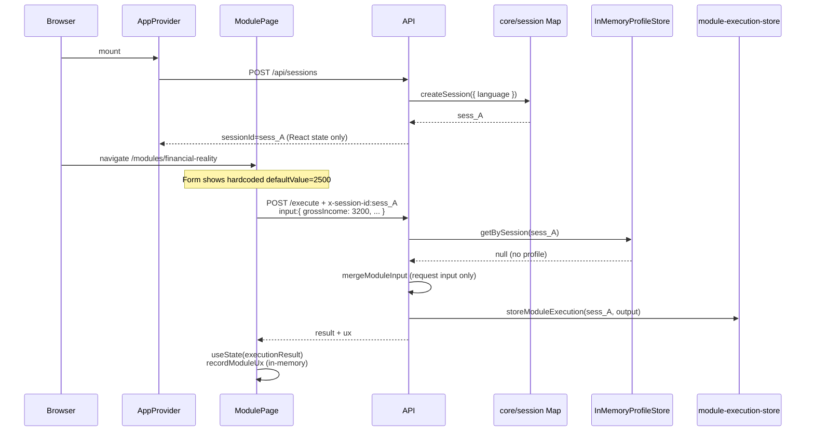
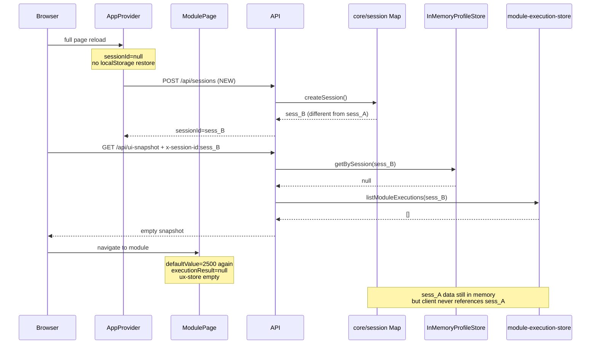

# User Data Persistence Lifecycle Audit

**Date:** June 2026  
**Auditor role:** Senior Staff Engineer  
**Scope:** End-to-end trace of user-entered data — module forms, API, profile, session, home hydration  
**Status:** Audit only — failure identification; no solutions proposed  
**Method:** Code inspection with file references

**Related audits:**  
`docs/audits/system-comprehensive-audit.md`,  
`docs/audits/mvp-r3-single-source-truth-audit.md`,  
`docs/audits/frontend-ux-alignment-audit.md`

---

## Executive Summary

User data loss on page refresh is **not a single bug**. It is a **broken persistence chain** across client session identity, profile writes, and UI hydration.

Three compounding breaks:

1. **Client `sessionId` is not durable** — every reload creates a new server session; prior session-scoped data is orphaned.
2. **No UI write path to profile** — module form input is never saved via `POST/PATCH /api/profile`.
3. **Module forms are not hydrated** — hardcoded `defaultValue` and `useState` results; no read from profile or `/api/ui-snapshot`.

A fourth ceiling: **all server state is in-memory** — nothing survives API process restart even with a stable session ID.

---

## Stage-by-Stage Analysis

### 1. Module form input

**Where:** Module pages, e.g. `apps/web/src/app/modules/financial-reality/page.tsx`

```90:106:apps/web/src/app/modules/financial-reality/page.tsx
            <input id="grossIncome" name="grossIncome" type="number" defaultValue={2500} min={0} required />
          ...
            <input id="monthlyRent" name="monthlyRent" type="number" defaultValue={800} min={0} required />
```

| Question | Answer |
|----------|--------|
| **Persisted?** | No — values exist only in the DOM until submit |
| **Stored where?** | React uncontrolled inputs + hardcoded `defaultValue` |
| **Survives page reload?** | No — remounts to hardcoded defaults (2500, 800, etc.) |
| **Survives server restart?** | N/A (client-only) |
| **Survives new browser session?** | No |

Same pattern on all 5 module pages: `useState` for results, `defaultValue` for forms, no `localStorage`, no profile/snapshot read.

---

### 2. API requests (module execute)

**Where:** `apps/web/src/lib/api.ts` → `POST /api/modules/:id/execute`

```41:56:apps/web/src/lib/api.ts
export async function executeModule<TInput, TOutput>(
  moduleId: string,
  input: TInput,
  context?: Record<string, unknown>,
  sessionId?: string
): Promise<ModuleResult<TOutput>> {
  const headers: Record<string, string> = { 'Content-Type': 'application/json' };
  if (sessionId) headers['x-session-id'] = sessionId;
  ...
```

| Question | Answer |
|----------|--------|
| **Persisted?** | Input is sent once per request; **not written to profile** |
| **Stored where?** | Ephemeral request body; output optionally stored server-side (see §6) |
| **Survives page reload?** | Only if same `sessionId` is reused **and** server process still holds state |
| **Survives server restart?** | No |
| **Survives new browser session?** | No (new `sessionId` each app boot) |

Module pages pass `sessionId` from context but never persist input fields themselves.

---

### 3. Profile API usage

**Where:** `apps/api/src/routes/profile.ts` — `POST/GET/PATCH /api/profile`

**Frontend usage:** **None.** Grep across `apps/web` finds no `/api/profile`, `createProfile`, or `fetchProfile` calls. Profile API exists only on the backend and in integration tests.

| Question | Answer |
|----------|--------|
| **Persisted?** | Yes, **if** `POST /api/profile` or `PATCH /api/profile` is called |
| **Stored where?** | `InMemoryProfileStore` (`packages/profile/src/adapters/in-memory-store.ts`) |
| **Survives page reload?** | Would, **if** same `sessionId` + profile binding — but UI never creates/updates profile |
| **Survives server restart?** | No |
| **Survives new browser session?** | No |

**Interpretation:** The profile write path is implemented but **not connected to the product UI**. Module form data never reaches profile storage.

---

### 4. Session creation

**Where:** `AppProvider.tsx` on every app mount

```44:48:apps/web/src/components/AppProvider.tsx
  useEffect(() => {
    createSession({ userProfile: { language } })
      .then(setSessionId)
      .catch(console.error);
  }, []);
```

```59:67:apps/web/src/lib/api.ts
export async function createSession(context?: Record<string, unknown>): Promise<string> {
  const res = await fetch(`${API_URL}/api/sessions`, {
    method: 'POST',
    ...
  });
  return data.sessionId;
}
```

| Question | Answer |
|----------|--------|
| **Persisted?** | Server-side in memory only |
| **Stored where?** | `packages/core/src/session/index.ts` → `Map<string, Session>` |
| **Survives page reload?** | **Server data would**, but client **always creates a new session** |
| **Survives server restart?** | No |
| **Survives new browser session?** | No |

**`sessionId` is held in React state only** — not in `localStorage`/`sessionStorage`. On reload, `sessionId` starts as `null`, then a **new** `sess_*` id is created.

---

### 5. Session binding

**Where:** Profile routes bind on `POST /api/profile` only

```36:41:apps/api/src/routes/profile.ts
    const profile = await profileEngine.createProfile(body);
    if (sessionId) {
      await profileEngine.bindSession(sessionId, profile.id);
      updateSessionContext(sessionId, { profileId: profile.id });
    }
```

**Module execute** reads binding via `resolveExecutionContext` → `profileEngine.getProfileBySession(sessionId)` but **never creates or updates** profile.

| Question | Answer |
|----------|--------|
| **Binding exists?** | Only after explicit `POST /api/profile` with `x-session-id` |
| **UI triggers binding?** | No |
| **Survives reload?** | Binding survives on server **only for the old sessionId**, which the client discards |

---

### 6. Profile storage

**Where:** `InMemoryProfileStore`

```24:27:packages/profile/src/adapters/in-memory-store.ts
export class InMemoryProfileStore implements ProfileStore {
  private profiles = new Map<string, ProfileRecord>();
  private revisions = new Map<string, ProfileRevision[]>();
  private sessionToProfile = new Map<string, string>();
```

| Question | Answer |
|----------|--------|
| **Persisted?** | In-process memory |
| **Survives page reload?** | Yes, if same `sessionId` is sent again |
| **Survives server restart?** | No |
| **Populated from module forms?** | No — execute path is read-only for profile |

Backend **can** merge profile → module input (`input-merger.ts`), but profile is empty for typical UI flows.

---

### 7. Profile retrieval

**Where:** `resolveExecutionContext` at execute time; `GET /api/ui-snapshot` on home

```56:58:packages/profile/src/engine/resolve-execution-context.ts
  const profile = sessionId
    ? await profileEngine.getProfileBySession(sessionId)
    : null;
```

Home loads snapshot with current (new) `sessionId`:

```49:50:apps/web/src/app/page.tsx
    fetch(`${API_URL}/api/ui-snapshot`, {
      headers: { 'x-session-id': sessionId },
```

| Question | Answer |
|----------|--------|
| **Retrieved on reload?** | Yes, but for a **new** session → `profile: null` |
| **Used by module forms?** | No — forms never call profile or snapshot |

---

### 8. Home page hydration

**Where:** `page.tsx` → `GET /api/ui-snapshot` → `HomeSnapshotRenderer`

| Question | Answer |
|----------|--------|
| **Data source** | Snapshot only (correct architecture) |
| **On reload** | New session → empty `profile`, empty `executions`, empty `uxSnapshot` |
| **Module form hydration** | Home does not feed module pages; no shared client store |

Home correctly renders server state — but server state for the **new** session is empty.

---

### 9. Module form default values

**Where:** Hardcoded per page; no read from profile, snapshot, or prior execution **inputs**

Backend merge config **would** supply defaults from profile if profile existed:

```17:44:packages/profile/src/engine/input-merger.ts
  'financial-reality': {
    grossIncome: {
      profile: (p) => p?.employment?.grossMonthlyIncome,
      defaultValue: 0,
    },
    ...
```

That only affects **server-side merged input at execute time**. The **visible form** still shows hardcoded `defaultValue={2500}` etc., and never pre-fills from profile or snapshot.

Module **results** after execute:

```43:44:apps/web/src/app/modules/financial-reality/page.tsx
  const [executionResult, setExecutionResult] = useState<ModuleResult<FinancialResult> | null>(null);
```

| Question | Answer |
|----------|--------|
| **Survives reload?** | No — React state cleared |
| **ux-store** | In-memory module singleton; cleared on reload (`ux-store.ts`) |

---

### Additional: Execution output storage (server)

```18:29:apps/api/src/module-execution-store.ts
export function storeModuleExecution(
  sessionId: string,
  moduleId: string,
  result: unknown,
  executedAt: string
): void {
```

Stores **module output** (not user input), keyed by `sessionId`. Unreachable after reload because client gets a new `sessionId`.

---

### What survives page reload (client)

| Key | Location | Data |
|-----|----------|------|
| `arrival-atlas-theme` | `localStorage` | Theme preference |
| `arrival_atlas_ftu_v1` | `localStorage` | FTU step (home no longer uses FTU UI) |

**Not persisted:** `sessionId`, profile, form values, module results, UX store.

---

## Sequence Diagrams — Actual Flow

### First visit: user fills form and submits



### Page reload: user loses data



---

## Architectural Failure Points

### Primary break: Client session identity is not durable

```32:32:apps/web/src/components/AppProvider.tsx
  const [sessionId, setSessionId] = useState<string | null>(null);
```

```44:48:apps/web/src/components/AppProvider.tsx
  useEffect(() => {
    createSession({ userProfile: { language } })
      .then(setSessionId)
```

Every reload creates **`sess_B`** while **`sess_A`**'s profile binding, execution outputs, and traces remain orphaned on the server until process restart.

This alone explains loss of home snapshot data (`profile`, `executions`, `uxSnapshot`) after refresh.

---

### Secondary break: No write path from UI to profile

Module execute is **read-only** for profile:

- `resolveExecutionContext` loads profile → merges into input → runs module
- No `updateProfile` / `createProfile` in `build-app.ts` execute handler
- Frontend never calls profile API

User input is **ephemeral**: sent in one POST, used for computation, not saved as profile fields. The profile merge infrastructure in `input-merger.ts` is **unused in practice** for normal UI flows.

---

### Tertiary break: Module UI is not hydrated from any durable source

- Forms: hardcoded `defaultValue`
- Results: `useState` only
- No read from `GET /api/profile`, `GET /api/ui-snapshot`, or stored execution inputs

Even with a stable `sessionId` and populated profile, **module pages would still show hardcoded defaults** because they do not consume profile/snapshot data.

---

### Quaternary break (durability ceiling): All server state is in-memory

```3:3:packages/core/src/session/index.ts
const sessions = new Map<string, Session>();
```

```25:27:packages/profile/src/adapters/in-memory-store.ts
  private profiles = new Map<string, ProfileRecord>();
  private sessionToProfile = new Map<string, string>();
```

```7:7:apps/api/src/module-execution-store.ts
const executionsBySession = new Map<string, Map<string, StoredModuleExecution>>();
```

Server restart wipes sessions, profiles, and executions regardless of client `sessionId` handling.

---

## Summary Table

| Stage | Persisted? | Storage | Page reload | Server restart | New browser |
|-------|------------|---------|-------------|----------------|-------------|
| Form input | No | DOM / hardcoded defaults | Lost | N/A | Lost |
| Module execute input | No (not to profile) | Request body only | Lost* | Lost | Lost* |
| Module execute output | Yes (server) | `module-execution-store` | Lost* | Lost | Lost* |
| Profile | Yes (if API called) | `InMemoryProfileStore` | Lost* | Lost | Lost* |
| Session | Yes (server) | `core/session` Map | Lost* | Lost | Lost* |
| sessionId (client) | **No** | React state | **Always new** | N/A | **Always new** |
| Module results (UI) | No | `useState` | Lost | N/A | Lost |
| UX store | No | JS module singleton | Lost | N/A | Lost |
| Theme / FTU | Yes | `localStorage` | Survives | Survives | Survives |

\*Survives only if the **same** `sessionId` is sent again — which the client does not do on reload.

---

## Root Cause Statement

**The architectural break that causes users to lose data after page refresh is the disconnection between ephemeral client session identity and the server's session-scoped persistence model**, compounded by **no UI write path to profile** and **no module form hydration from durable state**.

On reload the app behaves like a **first-time visitor with a new server session**, while all prior user data remains attached to a **discarded session ID** the frontend never retrieves. Module forms and results were never wired to read from profile, snapshot, or any client-side persistence layer.

---

*End of audit. No remediation proposed.*
