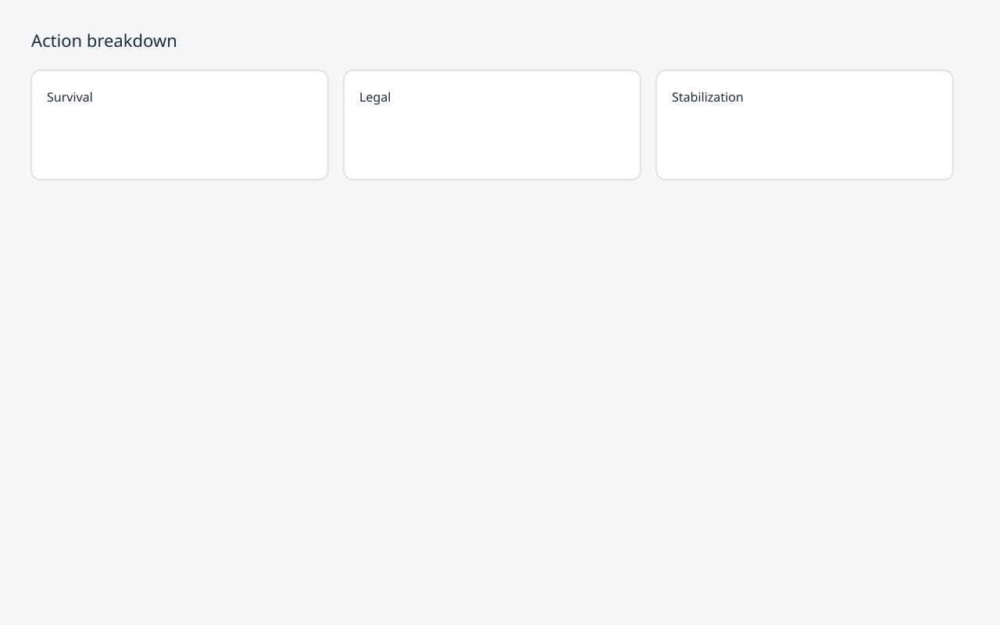
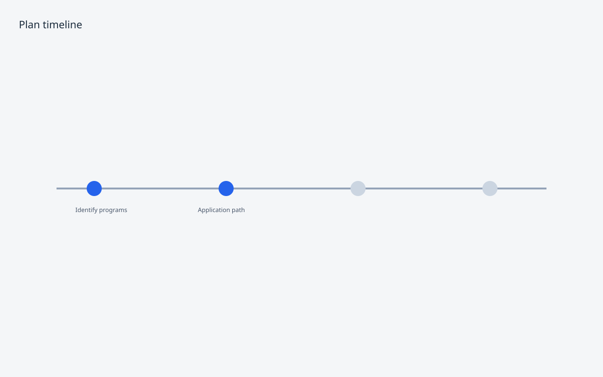
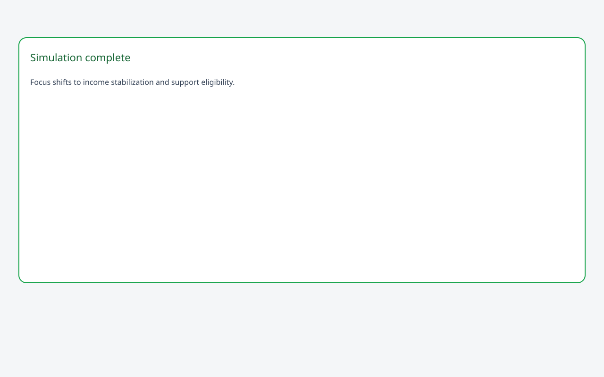
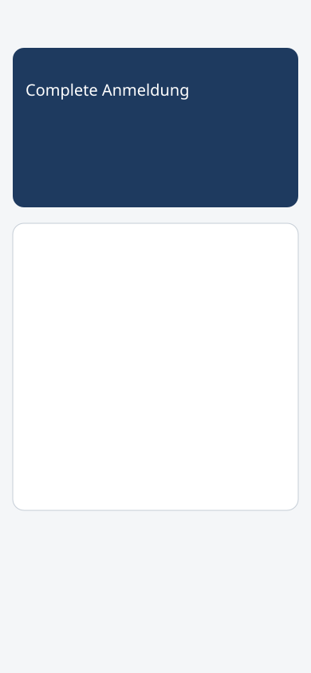

# Life Event Module — Showcase gallery

Audience: product, partnerships, and onboarding—no engineering background required.

Assets live in [`screenshots/`](./screenshots/). SVG wireframes ship with PH-4; replace with PNG captures using the [capture guide](./screenshots/README.md).

---

## Home

### Active plan

| Field | Detail |
|-------|--------|
| **Title** | Home — active plan |
| **Purpose** | Show that Atlas surfaces one prioritized plan on arrival, not a module grid. |
| **State** | Persona A (`new-arrival`), `arrival_unregistered`, focus: Complete Anmeldung |
| **Explanation** | The home snapshot answers “what should I do first?” immediately after login. |

### Scenario banner

| Field | Detail |
|-------|--------|
| **Title** | Home — scenario overlay |
| **Purpose** | Demonstrate “what if” context without leaving Home. |
| **State** | Persona B (`job-loss`), scenario `job_loss` |
| **Explanation** | When life changes, Atlas flags the shift and links to deeper exploration. |

### Localized (German)

| Field | Detail |
|-------|--------|
| **Title** | Home — German localization |
| **Purpose** | Prove L10n is active for newcomer audiences. |
| **State** | Persona A, language **DE** |
| **Explanation** | Labels, severity, and plan copy render in the user’s language. |

---

## Module page

### Hero

| Field | Detail |
|-------|--------|
| **Title** | Life Event — hero |
| **Purpose** | Single primary CTA aligned to current life state. |
| **State** | Persona A on `/modules/life-event` |
| **Explanation** | Hero states the constraint and one action—no competing buttons. |

### Action breakdown

| Field | Detail |
|-------|--------|
| **Title** | Life Event — action breakdown |
| **Purpose** | Show categorized next steps (legal, survival, stabilization). |
| **State** | Persona B (`economic_setup_pending`) |
| **Explanation** | Users see *why* steps are grouped, not just a flat task list. |

### Timeline

| Field | Detail |
|-------|--------|
| **Title** | Life Event — timeline |
| **Purpose** | Visualize phased progression over weeks and months. |
| **State** | Persona C (`benefits_exploration`) |
| **Explanation** | Timeline communicates sequence without implying fixed deadlines. |

---

## Scenario explorer

### Configured example

| Field | Detail |
|-------|--------|
| **Title** | Scenario Explorer — configured |
| **Purpose** | User selects a life event to simulate before committing. |
| **State** | Persona B, `?event=job_loss#explorer` |
| **Explanation** | Explorer is optional overlay—core plan still comes from the real planner. |

### Completed example

| Field | Detail |
|-------|--------|
| **Title** | Scenario Explorer — completed |
| **Purpose** | Show outcome narrative after simulation. |
| **State** | Persona B after submitting explorer |
| **Explanation** | Completing a scenario explains expected shifts in focus and severity. |

---

## Mobile

### Home

| Field | Detail |
|-------|--------|
| **Title** | Mobile — Home |
| **Purpose** | Confirm plan-first layout on small screens. |
| **State** | Persona A, 390px viewport |
| **Explanation** | Critical focus remains visible without horizontal scrolling. |

### Module page

| Field | Detail |
|-------|--------|
| **Title** | Mobile — module |
| **Purpose** | Hero and breakdown remain readable on phone form factors. |
| **State** | Persona A, `/modules/life-event` |
| **Explanation** | Same planner output as desktop—responsive presentation only. |
