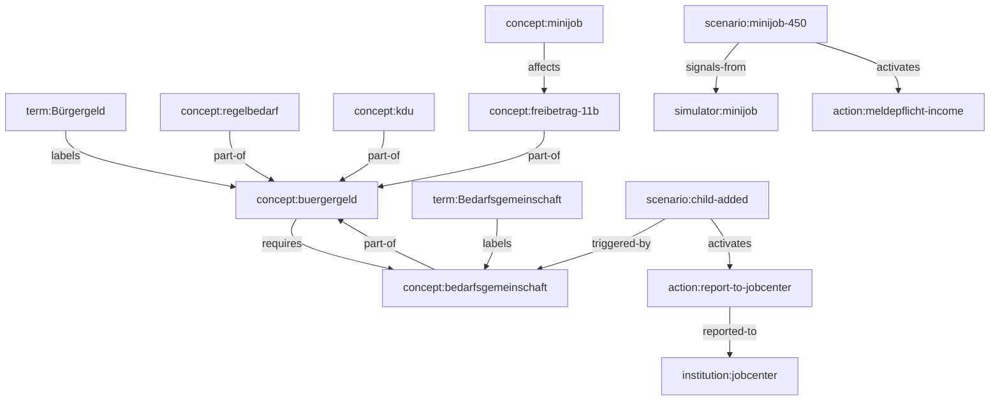

# System Understanding Engine v2 — Architecture & Product Design

**Document type:** Product strategy + information architecture proposal  
**Current module:** `system-translation` v1.0.0  
**Target:** System Understanding Engine (SUE) v2.0.0  
**Author role:** Product Strategist / Information Architect  
**Date:** June 2026  
**Status:** Proposal — **not implemented**  
**Related docs:**  
`docs/core/current-state.md`, `docs/identity/user-profile-engine-design.md`, `docs/benefits/benefits-simulator-design.md`, `docs/benefits/benefits-simulator-ui-contract.md`

---

## Executive Summary

Arrival Atlas today offers a **glossary-based System Translation Module**: 8 static German terms with flat definitions and weak `relatedTerms` links. It answers *"What does this word mean?"* but not *"How does this concept affect my life?"*

This document proposes redesigning the module into a **System Understanding Engine (SUE)** — a structured knowledge system for migrants navigating German administrative, financial, and social systems.

The engine moves from:

```
Term → definition
```

To:

```
Term → Concept → Related Concepts → Life Scenarios → Actions / Recommendations
```

**Benefits Simulator outputs** become the **scenario signal layer**: when a user models unemployment, Minijob, or household changes, SUE maps those structured events to relevant concepts, obligations, and next steps — deterministically, without duplicating financial math.

**Recommendation:** Evolve `system-translation` into `system-understanding` (or v2 under same ID with breaking output schema). Store knowledge as a **concept graph** in `@arrival-atlas/shared-services/knowledge`, not as a flat glossary array.

---

## 1. Current State Audit

### 1.1 Implementation inventory

| Component | Location | State |
|-----------|----------|-------|
| Module orchestrator | `packages/modules/src/system-translation/index.ts` | 80 LOC |
| Glossary store | `packages/shared-services/src/translation/index.ts` | 8 entries, in-memory |
| UI | `apps/web/src/app/modules/system-translation/page.tsx` | Search + card list |
| Profile integration | None | Only `context.userProfile.language` |
| Policy registry | Unregistered | Default `preferredLanguage` only |

### 1.2 Current data model

```typescript
TranslationEntry {
  term: string
  category: enum (6 values)
  translations: { de, en, ru, ua }
  explanation: { de, en, ru, ua }
  relatedTerms?: string[]   // unstructured string refs
}
```

### 1.3 Current module contract

**Input:** `query`, `mode` (lookup | search | category), optional `category`  
**Output:** `results[]` with term, translation, explanation, category, relatedTerms  
**Context used:** `userProfile.language` only

### 1.4 Strengths

| Strength | Value |
|----------|-------|
| Multilingual foundation | 4 languages wired (DE/EN/RU/UA) |
| Category taxonomy | 6 domains align with Arrival Atlas modules |
| Module isolation | Clean `Module.execute()` boundary |
| Deterministic | No LLM; predictable outputs |
| Related terms hint | Nascent graph potential |

### 1.5 Critical gaps

| Gap | Impact |
|-----|--------|
| **Flat glossary** | No concept hierarchy; synonyms and legal constructs collapsed into one string |
| **Weak relationships** | `relatedTerms` are untyped strings — no edge semantics (requires, affects, reported-to) |
| **No scenario layer** | User cannot connect "child added" to Bürgergeld recalculation |
| **No actionable output** | Definitions only; no institutions, deadlines, or Meldepflicht |
| **No profile awareness** | Cannot personalize ("you receive Bürgergeld → this concept applies to you") |
| **No cross-module bridge** | Benefits Simulator produces risks; glossary cannot consume them |
| **Tiny corpus** | 8 terms vs hundreds needed for MVP usefulness |
| **No versioning** | Content changes are code edits, not data migrations |
| **Search-only UX** | No guided exploration paths |

### 1.6 Comparison to platform maturity

| Capability | Financial / Benefits stack | System Translation v1 |
|------------|---------------------------|----------------------|
| Structured domain model | ✅ Household, employment, scenarios | ❌ Flat entries |
| Scenario outputs | ✅ Benefits Simulator | ❌ None |
| Profile merge | ✅ Input merger + policy | ❌ Language only |
| Golden fixtures | ✅ 12 scenarios | ❌ None |
| Actionable decisions | ✅ riskWarnings, recommendations | ❌ explanation text only |

SUE v2 must **catch up to the decision-engine pattern** already established by Financial Reality and Benefits Simulator — but for **knowledge and obligations**, not calculations.

---

## 2. Product Vision

### 2.1 Positioning shift

| v1 | v2 |
|----|-----|
| System Translation | System Understanding |
| Dictionary | Decision-oriented knowledge graph |
| "What is Bürgergeld?" | "What is Bürgergeld, how does it relate to my household, what changes if I start a Minijob, and what must I do?" |
| Passive lookup | Active exploration + personalized scenario binding |

### 2.2 User questions SUE must answer

1. **Lexical** — What does this German term mean in plain language?
2. **Conceptual** — What system rule or institution does this belong to?
3. **Relational** — What other concepts do I need to understand first / next?
4. **Situational** — How does this apply given my profile and simulated changes?
5. **Actionable** — What should I do, where, by when?

### 2.3 Non-goals (v2)

| Non-goal | Reason |
|----------|--------|
| LLM-generated explanations | Determinism requirement; Phase 3+ optional enrichment |
| Legal advice | Decision support + obligation pointers only |
| Replacing Benefits Simulator math | SUE consumes simulator **signals**, never recalculates |
| Full Wohngeld / ALG I knowledge base | Phased content expansion |
| Real-time Jobcenter API | Out of scope |

---

## 3. Knowledge Stack Model

### 3.1 Five-layer stack

```
┌─────────────────────────────────────────────────────────────┐
│  Layer 5: Actions / Recommendations                          │
│  Institutions, deadlines, Meldepflicht, document checklist   │
└────────────────────────────┬────────────────────────────────┘
                             │ triggered by
┌────────────────────────────▼────────────────────────────────┐
│  Layer 4: Life Scenarios                                     │
│  Event signals from Benefits Simulator + profile state         │
└────────────────────────────┬────────────────────────────────┘
                             │ contextualizes
┌────────────────────────────▼────────────────────────────────┐
│  Layer 3: Related Concepts                                   │
│  Typed graph edges between concepts                          │
└────────────────────────────┬────────────────────────────────┘
                             │ groups
┌────────────────────────────▼────────────────────────────────┐
│  Layer 2: Concept                                            │
│  Canonical knowledge unit (eligibility unit, institution…)     │
└────────────────────────────┬────────────────────────────────┘
                             │ labeled by
┌────────────────────────────▼────────────────────────────────┐
│  Layer 1: Term                                               │
│  Surface forms (DE primary + translations + aliases)         │
└─────────────────────────────────────────────────────────────┘
```

### 3.2 Worked example: Bedarfsgemeinschaft

```
Term: "Bedarfsgemeinschaft"
  ↓
Concept: bedarfsgemeinschaft
  - domain: benefits
  - summary: Bürgergeld eligibility unit — household members assessed together
  - legalRef: § 7 Abs. 3 SGB II
  ↓
Related Concepts:
  - buergergeld (parent-benefit)
  - regelbedarf (determines-need)
  - household-income (affects-eligibility)
  - partner-household (composition-rule)
  - meldepflicht (triggers-obligation)
  ↓
Life Scenarios (simulator event bindings):
  - child-added → regelbedarf increase, Kindergeld interaction
  - partner-employment-change → countable income change
  - unemployment → Bedarfsgemeinschaft need may rise
  - rent-change → KdU component shifts
  ↓
Actions:
  - Report household change to Jobcenter within 2 weeks
  - Submit updated Mietvertrag if rent changed
  - Expect benefit recalculation (Nachforderung risk if not reported)
```

---

## 4. Concept Graph Model

### 4.1 Node types

| Node type | ID pattern | Purpose |
|-----------|------------|---------|
| `term` | `term:anmeldung` | Lexical surface form |
| `concept` | `concept:buergergeld` | Canonical knowledge unit |
| `institution` | `institution:jobcenter` | Where user acts |
| `scenario` | `scenario:child-added` | Life event template |
| `action` | `action:report-to-jobcenter` | Recommended user step |

### 4.2 Edge types (typed relationships)

| Edge | Semantics | Example |
|------|-----------|---------|
| `labels` | Term → Concept | `term:buergergeld` → `concept:buergergeld` |
| `alias-of` | Term → Term | `term:hartz-iv` → `term:buergergeld` (historical) |
| `part-of` | Concept → Concept | `concept:regelsatz` part-of `concept:buergergeld` |
| `requires` | Concept → Concept | `concept:buergergeld` requires `concept:bedarfsgemeinschaft` |
| `affects` | Concept → Concept | `concept:minijob` affects `concept:buergergeld-freibetrag` |
| `reported-to` | Concept → Institution | `concept:income-change` reported-to `institution:jobcenter` |
| `triggered-by` | Scenario → Concept | `scenario:minijob` triggered-by `concept:erwerbseinkommen` |
| `activates` | Scenario → Action | `scenario:child-added` activates `action:report-household-change` |
| `applies-when` | Concept → Profile predicate | `concept:buergergeld` applies-when `benefits.receivingBuergergeld` |
| `signals-from` | Scenario → Simulator event | `scenario:rent-change` signals-from `rent-change` |

### 4.3 Graph diagram (subset)



### 4.4 Graph constraints

| Rule | Rationale |
|------|-----------|
| Terms always point to exactly one primary concept | Disambiguation via `alias-of` for synonyms |
| Concepts form DAG within `part-of` / `requires` | Prevent circular prerequisite loops |
| Scenarios never perform calculations | Bind to simulator **event types** only |
| Actions are deterministic templates | Parameterized by profile/simulator signals, not LLM |

---

## 5. Data Model

### 5.1 Core types (proposed)

```typescript
type KnowledgeDomain =
  | 'administrative'
  | 'financial'
  | 'benefits'
  | 'healthcare'
  | 'employment'
  | 'housing'
  | 'legal';

type SupportedLocale = 'de' | 'en' | 'ru' | 'ua';

interface KnowledgeTerm {
  id: string;                    // term:anmeldung
  canonical: string;             // German surface form
  aliases: string[];
  conceptId: string;
  localeLabels: Partial<Record<SupportedLocale, string>>;
}

interface KnowledgeConcept {
  id: string;                    // concept:bedarfsgemeinschaft
  domain: KnowledgeDomain;
  slug: string;
  title: LocalizedString;
  summary: LocalizedString;
  detail: LocalizedString;
  legalReferences?: string[];
  profilePredicates?: ProfilePredicate[];
  contentVersion: string;
}

interface KnowledgeEdge {
  id: string;
  type: EdgeType;
  fromId: string;
  toId: string;
  weight?: number;               // navigation ranking
  metadata?: Record<string, unknown>;
}

interface LifeScenario {
  id: string;                    // scenario:child-added
  slug: string;
  title: LocalizedString;
  description: LocalizedString;
  simulatorEventTypes: SimulatorEventType[];  // from benefits-simulator
  affectedConceptIds: string[];
  profileTriggers?: ProfilePredicate[];
}

interface KnowledgeAction {
  id: string;
  title: LocalizedString;
  description: LocalizedString;
  institutionId?: string;
  deadline?: LocalizedString;    // e.g. "Within 2 weeks"
  priority: 'critical' | 'high' | 'medium' | 'low';
  category: 'reporting' | 'document' | 'appointment' | 'review';
}

type LocalizedString = Partial<Record<SupportedLocale, string>>;

type ProfilePredicate =
  | { field: 'benefits.receivingBuergergeld'; equals: boolean }
  | { field: 'employment.status'; in: string[] }
  | { field: 'household.maritalStatus'; equals: string }
  | { field: 'residency.status'; in: string[] }
  | { field: 'insurance.hasCoverage'; equals: boolean };
```

### 5.2 Simulator signal binding

SUE consumes **structured signals** from Benefits Simulator output — not raw profile:

```typescript
interface SimulatorSignalBundle {
  source: 'benefits-simulator';
  schemaVersion: string;
  baseline: {
    totalHouseholdResources: number;
    buergergeldAfter: number;
  };
  scenarios: Array<{
    id: string;
    eventsApplied: string[];       // unemployment, minijob, child-added, rent-change
    buergergeldDelta: number;
    deltaFromBaseline: number;
  }>;
  riskWarnings: Array<{
    id: string;
    severity: string;
    category: string;
  }>;
  comparison: {
    bestScenarioId: string | null;
    spread: number;
  };
}
```

Mapping table (deterministic):

| `eventsApplied` | Activated scenario nodes | Priority concepts |
|-----------------|-------------------------|-------------------|
| `unemployment` | `scenario:job-loss` | buergergeld, alg-transition, meldepflicht |
| `minijob` | `scenario:minijob-start` | freibetrag-11b, meldepflicht, minijob |
| `midijob` | `scenario:midijob-start` | gleitzone, freibetrag-11b |
| `child-added` | `scenario:child-added` | bedarfsgemeinschaft, regelbedarf, kindergeld |
| `child-removed` | `scenario:child-removed` | bedarfsgemeinschaft, regelbedarf |
| `rent-change` | `scenario:rent-change` | kdu, wohngeld-hint |
| `part-time-employment` | `scenario:income-change` | erwerbseinkommen, freibetrag |
| `partner-employment-change` | `scenario:partner-income-change` | bedarfsgemeinschaft, countable-income |

### 5.3 Profile Engine compatibility

SUE reads profile **only via `resolveExecutionContext()`** — same pattern as other modules.

| Profile field | SUE use |
|---------------|---------|
| `preferredLanguage` | Content locale |
| `residency.status` | Filter concepts (e.g. asylum-seeker pathways) |
| `employment.status` | Predicate: employed vs unemployed concept sets |
| `household.maritalStatus` | Bedarfsgemeinschaft / partner concepts |
| `household.children` | Child-related scenarios |
| `benefits.receivingBuergergeld` | Activate benefits obligation layer |
| `benefits.receivingAlg1` | ALG I vs Bürgergeld concept routing |
| `insurance.hasCoverage` | Healthcare cross-links |
| `location.bundesland` | Region-specific institution hints (Phase 2) |

**Policy proposal (`SYSTEM_UNDERSTANDING_POLICY`):**

```typescript
{
  moduleId: 'system-understanding',
  allowedFields: [
    'preferredLanguage', 'residency', 'household',
    'employment', 'benefits', 'insurance', 'location',
  ],
  sensitiveFields: ['employment.grossMonthlyIncome'],
  allowExtensions: true,
  allowedExtensions: ['system-understanding'],
}
```

Sensitive income values are **not required** for SUE — predicates use status/boolean flags only.

### 5.4 Module output model (v2)

```typescript
interface SystemUnderstandingOutput {
  meta: {
    schemaVersion: '2.0.0';
    contentVersion: string;
    locale: SupportedLocale;
    personalizationLevel: 'none' | 'profile' | 'profile-and-simulator';
  };

  entry: {
    term?: KnowledgeTermView;
    concept: KnowledgeConceptView;
  };

  relatedConcepts: KnowledgeConceptView[];

  applicableScenarios: Array<{
    scenario: LifeScenarioView;
    relevance: 'high' | 'medium' | 'low';
    reason: string;
    simulatorBinding?: {
      scenarioId: string;
      eventsApplied: string[];
      buergergeldDelta?: number;
    };
  }>;

  actions: Array<{
    action: KnowledgeActionView;
    priority: 'critical' | 'high' | 'medium' | 'low';
    triggeredBy: string;          // concept or scenario id
    institution?: InstitutionView;
  }>;

  explorationPath: string[];      // ordered concept ids for guided nav

  contextHint?: string;
}
```

---

## 6. Navigation Model

### 6.1 Entry modes

| Mode | User intent | Entry point |
|------|-------------|-------------|
| **Term search** | "I heard this word" | Search → Term → Concept |
| **Concept browse** | "I want to understand benefits" | Domain → Concept list |
| **Scenario explore** | "What if I lose my job?" | Scenario index → Concepts → Actions |
| **Profile-aware** | "What applies to me?" | Profile predicates → filtered concept set |
| **Simulator-linked** | "Explain my Minijob result" | Simulator output → bound scenarios → concepts |

### 6.2 Exploration graph navigation

Default user journey within a concept page:

```
1. Concept summary (hero)
2. Related concepts (prerequisite / next-step chips)
3. "Applies to you" band (profile predicates matched)
4. Life scenarios (cards — linked to Benefits Simulator CTA)
5. Actions & obligations (institution + deadline)
6. Terms & aliases (lexical footer)
```

### 6.3 Navigation rules (deterministic ranking)

| Signal | Ranking boost |
|--------|---------------|
| Profile predicate match | +3 |
| Simulator event match | +5 |
| `requires` edge from current concept | +2 |
| `part-of` parent concept | +1 |
| User's `preferredLanguage` content available | filter (hard) |

No ML ranking in v2 — weighted graph traversal only.

### 6.4 Cross-module navigation (UI-level, no imports)

| From | To | Trigger |
|------|-----|---------|
| SUE concept `buergergeld` | Benefits Simulator | "Model your household impact" CTA |
| Benefits Simulator `riskWarnings` | SUE | "Explain this warning" deep-link with `warningId` |
| Financial Reality decisions | SUE | Concept link on decision title |
| Life Event module | SUE | Event type → scenario node |

### 6.5 URL / state model (proposed)

```
/modules/system-understanding
  ?q=buergergeld              # term search
  ?concept=bedarfsgemeinschaft # direct concept
  ?scenario=child-added        # scenario entry
  ?warning=MELDEPFLICHT_*      # from simulator
  ?domain=benefits             # browse
```

---

## 7. Content Architecture

### 7.1 Storage layers

| Layer | Store | Format |
|-------|-------|--------|
| **Graph data** | `@arrival-atlas/shared-services/knowledge/graph/` | JSON / YAML per domain |
| **Localized copy** | `content/system-understanding/{locale}/` | JSON keyed by concept id |
| **Version manifest** | `knowledge-manifest.json` | `contentVersion`, checksum, domains |
| **Runtime index** | In-memory Maps (Phase 1) → PostgreSQL JSONB (Phase 2) | Indexed by id, slug, term |

### 7.2 Content file structure (proposed)

```
packages/shared-services/src/knowledge/
  graph/
    nodes/
      concepts/
        benefits.buergergeld.json
        benefits.bedarfsgemeinschaft.json
      terms/
        buergergeld.json
      scenarios/
        child-added.json
      actions/
        report-to-jobcenter.json
      institutions/
        jobcenter.json
    edges/
      benefits.json
  index/
    knowledge-index.ts          # deterministic loader
    graph-traversal.ts          # pure navigation
  bindings/
    simulator-event-map.ts      # event → scenario
    profile-predicate-eval.ts     # profile → concept filter
  locales/
    en.json
    de.json
    ru.json
    ua.json
```

### 7.3 Content authoring workflow

```
1. Author writes concept node (domain expert + legal review)
2. Link edges to related concepts (typed)
3. Bind life scenarios to simulator event types
4. Attach actions with institution + deadline
5. Add localized copy per locale
6. Validate graph (DAG check, orphan detection)
7. Bump contentVersion in manifest
8. Golden fixture: concept → expected actions for profile X
```

### 7.4 Deterministic personalization

Personalization is **rule-based**, not generative:

```typescript
function resolveApplicableScenarios(
  conceptId: string,
  profile: ProfilePredicateContext,
  simulator?: SimulatorSignalBundle
): ApplicableScenario[] {
  const candidates = graph.scenariosLinkedTo(conceptId);
  return candidates
    .map((s) => ({
      scenario: s,
      score: scoreScenario(s, profile, simulator),
    }))
    .filter((r) => r.score > 0)
    .sort((a, b) => b.score - a.score);
}
```

### 7.5 Content scope (MVP v2)

| Domain | Target concepts | Priority |
|--------|-----------------|----------|
| Benefits | 25 | P0 — aligns with Benefits Simulator |
| Employment | 15 | P0 |
| Administrative | 15 | P1 |
| Housing | 10 | P1 |
| Healthcare | 10 | P2 |
| **Total MVP** | **~75 concepts** | |

Migrate existing 8 glossary entries → 8 concepts + enriched edges.

---

## 8. Module Architecture (v2)

### 8.1 Module identity

| Option | Recommendation |
|--------|----------------|
| Keep `system-translation` id | Breaking output change; confusing name |
| Rename to `system-understanding` | ✅ Clear product positioning |
| Feature flag `knowledgeGraph: true` | Gradual rollout |

### 8.2 Input schema (proposed)

```typescript
interface SystemUnderstandingInput {
  mode: 'term' | 'concept' | 'scenario' | 'explore' | 'explain-warning';

  // Entry identifiers (one required per mode)
  query?: string;               // term search
  conceptId?: string;
  scenarioId?: string;
  warningId?: string;           // from benefits-simulator riskWarnings

  domain?: KnowledgeDomain;     // explore mode filter

  // Optional simulator signals (passed from client after simulator run)
  simulatorSignals?: SimulatorSignalBundle;
}
```

### 8.3 Processing pipeline (deterministic)

```
execute(input, context)
  1. Resolve locale from context.userProfile.language / profile
  2. Load entry node (term/concept/scenario/warning resolver)
  3. Traverse graph → relatedConcepts (typed edges, ranked)
  4. Evaluate profile predicates → filter/boost
  5. If simulatorSignals present → bind scenarios + attach deltas
  6. Collect actions from activated scenarios + concept obligations
  7. Build explorationPath (deterministic walk)
  8. Return SystemUnderstandingOutput
```

**No financial calculations.** Numeric values in output come from `simulatorSignals` passthrough only.

### 8.4 Shared services package

New subsystem: `@arrival-atlas/shared-services/knowledge`

| Responsibility | Not responsible for |
|----------------|---------------------|
| Graph storage & traversal | Payroll / Bürgergeld math |
| Predicate evaluation | Profile persistence |
| Simulator event binding | LLM content generation |
| Localization resolution | UI rendering |

---

## 9. Migration Plan

### Phase M0 — Foundation (1–2 weeks)

| Task | Output |
|------|--------|
| Define graph JSON schema + validators | `knowledge/graph-schema.json` |
| Migrate 8 glossary entries → concept nodes | 8 concept files + term labels |
| Build `knowledge-index` loader | Unit tests |
| Add golden fixtures (concept → actions) | 10 fixtures |

### Phase M1 — Module v2 shell (1–2 weeks)

| Task | Output |
|------|--------|
| Create `system-understanding` module (or v2 flag) | New input/output schemas |
| Wire profile policy + input merger | Language + predicates |
| Implement graph traversal engine | Pure functions |
| Deprecate v1 output shape behind flag | Backward compat period |

### Phase M2 — Simulator bridge (1 week)

| Task | Output |
|------|--------|
| `simulator-event-map.ts` bindings | All 12 golden event types |
| `explain-warning` mode | warningId → concepts → actions |
| UI deep-link contract | SUE ↔ Simulator |

### Phase M3 — Content expansion (ongoing)

| Task | Target |
|------|--------|
| Benefits domain concepts | 25 |
| Employment domain | 15 |
| Localized copy review (RU/UA) | Native speaker QA |
| PostgreSQL content store | Phase 2 infra |

### Phase M4 — Deprecation

| Step | Action |
|------|--------|
| 1 | v1 API returns deprecation header |
| 2 | Web UI switches to v2 navigation |
| 3 | Remove `translation/index.ts` glossary array |
| 4 | Archive v1 module output schema |

### Glossary → concept migration map

| v1 term | v2 concept id | Enrichment |
|---------|---------------|------------|
| Anmeldung | `concept:anmeldung` | + scenario: move-in, action: register within 14 days |
| Bürgergeld | `concept:buergergeld` | + requires bedarfsgemeinschaft, simulator bindings |
| Krankenkasse | `concept:krankenkasse` | + requires insurance coverage concepts |
| Steuerklasse | `concept:steuerklasse` | + affects net-income, link financial-reality |
| Jobcenter | `institution:jobcenter` | + actions: report income, appointment |
| Finanzamt | `institution:finanzamt` | + tax filing actions |
| Krankenversicherung | `concept:krankenversicherung` | + GKV/PKV branch |
| Wohnungsgeberbestätigung | `concept:wohnungsgeberbestaetigung` | + requires anmeldung |

---

## 10. Example End-to-End Flow

### User: employed migrant, searches "Bedarfsgemeinschaft"

**Profile:** married, 1 child, not on Bürgergeld  
**No simulator run yet**

**SUE output (abbreviated):**

```json
{
  "entry": {
    "concept": {
      "id": "concept:bedarfsgemeinschaft",
      "title": "Household benefit unit",
      "summary": "Your household is assessed as one unit for Bürgergeld..."
    }
  },
  "relatedConcepts": [
    { "id": "concept:buergergeld", "relation": "part-of" },
    { "id": "concept:regelbedarf", "relation": "determines" },
    { "id": "concept:kindergeld", "relation": "affects" }
  ],
  "applicableScenarios": [
    {
      "scenario": { "id": "scenario:child-added", "title": "Adding a child" },
      "relevance": "high",
      "reason": "Your profile includes a child in household"
    }
  ],
  "actions": [],
  "explorationPath": ["concept:bedarfsgemeinschaft", "concept:buergergeld", "concept:regelbedarf"]
}
```

### User: runs Benefits Simulator — Minijob €450 on Bürgergeld baseline

**Client passes `simulatorSignals` to SUE `explain-warning` or concept mode**

**Additional SUE output:**

```json
{
  "applicableScenarios": [{
    "scenario": { "id": "scenario:minijob-start" },
    "relevance": "high",
    "simulatorBinding": {
      "scenarioId": "minijob-450",
      "eventsApplied": ["minijob"],
      "buergergeldDelta": -280
    }
  }],
  "actions": [
    {
      "action": { "title": "Report Minijob income to Jobcenter" },
      "priority": "high",
      "triggeredBy": "scenario:minijob-start",
      "institution": { "id": "institution:jobcenter" }
    }
  ]
}
```

---

## 11. Risk Register

| Risk | Mitigation |
|------|------------|
| Content staleness (law changes) | `contentVersion` + legal review cadence |
| Scope creep into calculations | Hard boundary: SUE reads simulator signals only |
| Graph complexity | Domain-partitioned files; max traversal depth 4 |
| Translation quality | Professional RU/UA review; not machine-translated |
| v1/v2 coexistence | Feature flag + deprecation window |

---

## 12. Success Criteria

| Criterion | Measure |
|-----------|---------|
| Knowledge is structured | ≥75 concepts with typed edges |
| Scenario binding works | 12 simulator event types mapped |
| Personalization is deterministic | Same profile + signals → same output |
| Profile compatible | Uses `resolveExecutionContext()` only |
| Actionable outputs | Every benefits concept has ≥1 action when predicates match |
| No duplicate math | Zero financial calculation code in SUE |
| Migration complete | All 8 v1 terms available in v2 with richer context |

---

## 13. Decision Summary

| Question | Decision |
|----------|----------|
| Rename module? | **Yes** → `system-understanding` (v2) |
| Knowledge store? | Graph in `@arrival-atlas/shared-services/knowledge` |
| Simulator integration? | **Signal bundle** input — not module import |
| LLM content? | **No** in v2 |
| Profile access? | Via pipeline + predicates only |
| Navigation? | Term → Concept → Related → Scenarios → Actions |

---

## Verdict

System Translation v1 is a **necessary but insufficient** layer for Arrival Atlas's decision-support mission. The platform already produces rich **scenario signals** (Benefits Simulator) and **profile context** (Profile Engine) — but the glossary cannot connect them.

System Understanding Engine v2 closes that gap with a **deterministic concept graph** that transforms terms into actionable knowledge paths, using simulator outputs as the scenario layer without duplicating financial engines.

**Recommended next step:** Approve M0 — graph schema + migration of 8 existing terms + 10 concept golden fixtures.
