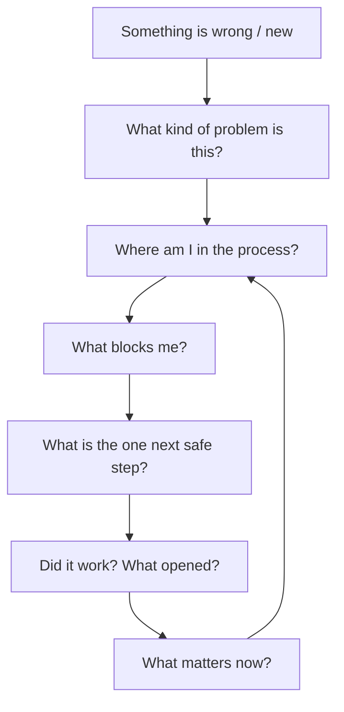

# User Mental Model

Users do not think in routes, modules, or galaxies.

They think in **problems, fears, deadlines, and dependencies**.

This document maps how humans actually reason — and how Arrival Atlas must adapt to them.

---

## The user's internal monologue

### What users think

```
"I have a problem."
"I might be doing something wrong."
"I don't know what comes first."
"I'm afraid of losing money / status / time."
"I need help now — or at least to know I'm not crazy."
```

### What users do NOT think

```
"I want to open Life Events."
"I should check Economic Reality."
"I need to update my Profile galaxy."
"I wonder what the Journey Guide mode is."
```

**Module names are implementation artifacts.** They must never be prerequisites for comprehension.

---

## The cognitive journey (ideal)



Arrival Atlas must mirror this loop — not a product map.

---

## Layer 1 — Situation awareness

**User question:** *“What is my life situation right now?”*

**Mental objects:**

- Where I live · who is in my household · how I earn · my legal status · my health coverage · what I already receive

**Product expression:** A single **Situation** — not seven disconnected forms.

The user should never wonder which “section” owns a fact. They wonder: *“Is this still true?”*

**Design implication:** Profile is not a destination. It is the **ground truth** beneath every recommendation.

---

## Layer 2 — Problem framing

**User question:** *“What kind of trouble is this?”*

Users bucket problems emotionally before bureaucratically:

| User bucket | Examples |
|-------------|----------|
| **Survival** | No income, can't pay rent, food insecurity |
| **Legal status** | Visa, registration, permit renewal |
| **Health** | Insurance, care access, disability support |
| **Work** | Job loss, contract, taxes, benefits at work |
| **Family** | Children, schools, benefits for dependents |
| **Future** | Language, qualifications, long-term stability |

**Design implication:** Entry should accept **problem language** (“I lost my job”) and translate internally — not force module selection.

---

## Layer 3 — Process position

**User question:** *“Am I early, on track, or already late?”*

Users think in **stages**, not features:

- Before registration · after registration · employed · unemployed · in crisis

**Design implication:** Time belongs in the model — deadlines, sequences, “you are here in week 2.” Not as anxiety fuel, but as **orientation**.

---

## Layer 4 — Dependency understanding

**User question:** *“Why can't I do this yet?”*

This is the core insight government sites fail to deliver.

Users assume personal failure when the real answer is **structural order**:

> “You need Anmeldung before health insurance change.”

**Design implication:** Locks must explain **cause**, not just status. Routes between nodes are not visual flair — they are **answers**.

---

## Layer 5 — Action selection

**User question:** *“What should I do next — specifically?”*

Under stress, users can handle **one** decision.

The mental model is not a menu. It is a **recommendation with justification**:

> “Do X because it unlocks Y and reduces risk Z.”

**Design implication:** One primary next step — always. Everything else is secondary or hidden until relevant.

---

## Layer 6 — Outcome verification

**User question:** *“Did that work? What changed?”*

Users fear silent failure — forms submitted into voids.

**Design implication:** Every write action closes with **human confirmation**: what was saved, what it affects, what is now possible.

---

## Layer 7 — Growing independence

**User question:** *“Can I handle the next things myself?”*

Over weeks, the user should need less narration — not because we remove the map, but because they **read the map**.

**Design implication:** Guide intensity fades with competence. The Situation Map remains.

---

## How the UI must adapt (not the user)

| User thinking | UI must NOT require | UI must provide |
|---------------|---------------------|-----------------|
| Problem-first | Module literacy | Problem → path routing |
| One next step | Feature comparison | Single recommendation |
| Cause of blocks | Trial-and-error | Explained locks |
| Progress | Memory | Visible state change |
| Trust | Technical vocabulary | Plain language + honesty |
| Return visits | Re-onboarding | Persistent situation |

---

## The forbidden mental model

If users internalize any of the following, we have failed:

- “This is a game map.”
- “This is a government website.”
- “This is a chatbot that might be wrong.”
- “This is a slideshow about immigration.”
- “This is a demo that might erase my answers.”

---

## Ideal information architecture (conceptual)

Not pages — **lenses on one Situation**:

| Lens | User-facing question |
|------|----------------------|
| **Now** | What should I do today? |
| **Situation** | What is true about my life? |
| **Money & support** | What can I access or optimize? |
| **Plan** | What sequence am I following? |
| **Explore** | What if something changes? |

Modules may implement lenses internally. Users should never be forced to learn the implementation map.

---

## Related documents

- [onboarding-philosophy.md](./onboarding-philosophy.md) — first-run expression of this model
- [journey-guide-philosophy.md](./journey-guide-philosophy.md) — the narration layer on this model
- [galaxy-design-language.md](./galaxy-design-language.md) — spatial encoding of dependencies
